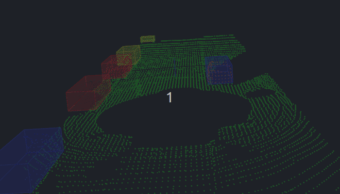

# Obstacle detection using LiDAR point clouds
### (based on [Sensor Fusion Nanodegree Program](https://www.udacity.com/course/sensor-fusion-engineer-nanodegree--nd313))



Current application allows to render:
* Single *pcd file (static render);
* Stream *pcd files;
* Render point cloud data (raw and filtered);
* Render segmented point clouds: road and obstacles;
* Render clustered obstacle point clouds wrapped inside bounding boxes;

Additionally, it allows to select:
* Whether to draw bounding boxes for the obstacle point clouds;
* Whether to render the road point cloud;

The initial environment was developed by [Aaron Brown](https://github.com/awbrown90).
I've implemented custom RANSAC, KD-Tree algorithms for point cloud segmentation and Euclidean clustering algorithm
along with some interface updates and command prompts that allow to set the runtime options.

## Environment

Current application has been built on:

* Ubuntu 22.04
* PCL - v1.14.1
* C++ v14
* gcc v11.4

**Note** The PCL library has been built from the [source code](https://github.com/PointCloudLibrary/pcl)
as the one installed with apt gives segmentation error. For Mac users:
[PCL Mac Compilation Docs](https://pcl.readthedocs.io/projects/tutorials/en/latest/compiling_pcl_macosx.html#compiling-pcl-macosx)

## Installation

### Ubuntu 

1. Clone this github repo:

   ```sh
   cd ~
   git clone https://github.com/cr0mwell/LiDAR_obstacle_detection.git
   ```

2. Execute the following commands in a terminal

   ```shell
   cd ~/SFND_Lidar_Obstacle_Detection
   mkdir build && cd build
   cmake ..
   make
   ./environment
   ```
   
### MAC

#### Install via Homebrew
1. install [homebrew](https://brew.sh/)
2. update homebrew 
	```bash
	$> brew update
	```
3. add  homebrew science [tap](https://docs.brew.sh/Taps) 
	```bash
	$> brew tap brewsci/science
	```
4. view pcl install options
	```bash
	$> brew options pcl
	```
5. install PCL 
	```bash
	$> brew install pcl
	```

6. Clone this github repo

   ```shell
   cd ~
   git clone https://github.com/cr0mwell/LiDAR_obstacle_detection.git
   ```

7. Execute the following commands in a terminal

   ```shell
   cd ~/SFND_Lidar_Obstacle_Detection
   mkdir build && cd build
   cmake ..
   make
   ./environment
   ```
If you get build errors related to Qt5, make sure that the path for Qt5 is correctly set in .bash_profile or .zsh_profile (Refer [#45](https://github.com/udacity/SFND_Lidar_Obstacle_Detection/issues/45))